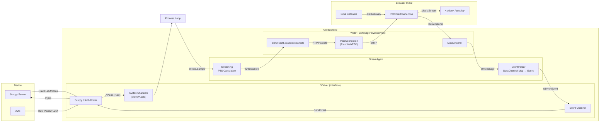

I'm still doing this part...

## Big Pictures

```mermaid
graph LR
    subgraph Device
        SCRCPY[Scrcpy Server]
        XVFB[Xvfb]
    end

    subgraph "Go Backend"
        subgraph SDriver ["SDriver (Interface)"]
            DRIVER_IMPL[Scrcpy / Xvfb Driver]
            CH_AV["AVBox Channels<br/>(Video/Audio)"]
            CH_EVENT[Event Channel]
        end

        subgraph Agent ["StreamAgent"]
            STREAMING["Streaming<br/>PTS Calculation"]
            EVENT_PARSER["EventParser<br/>DataChannel Msg → Event"]
        end

        subgraph Service ["WebRTCManager (webservice)"]
            TRACK[pion/TrackLocalStaticSample]
            PC["PeerConnection<br/>(Pion WebRTC)"]
            DC[DataChannel]
        end
    end

    subgraph Browser ["Browser Client"]
        JS_PC[RTCPeerConnection]
        JS_VIDEO["&lt;video&gt; Autoplay"]
        JS_INPUT[Input Listeners]
    end

    %% Media Flow (Video/Audio)
    SCRCPY -->|Raw H.264/Opus| DRIVER_IMPL
    XVFB -->|Raw Pixels/H.264| DRIVER_IMPL
    DRIVER_IMPL -->|"AVBox (Raw)"| CH_AV
    CH_AV --> streamAgent_Process[Process Loop]
    streamAgent_Process -->|media.Sample| STREAMING
    STREAMING -->|WriteSample| TRACK
    TRACK -->|RTP Packets| PC
    PC -->|SRTP| JS_PC
    JS_PC -->|MediaStream| JS_VIDEO

    %% Control Flow (Input)
    JS_INPUT -->|JSON/Binary| JS_PC
    JS_PC -->|DataChannel| DC
    DC -->|OnMessage| EVENT_PARSER
    EVENT_PARSER -->|sdriver.Event| CH_EVENT
    CH_EVENT -->|SendEvent| DRIVER_IMPL
    DRIVER_IMPL -->|Inject| SCRCPY
```